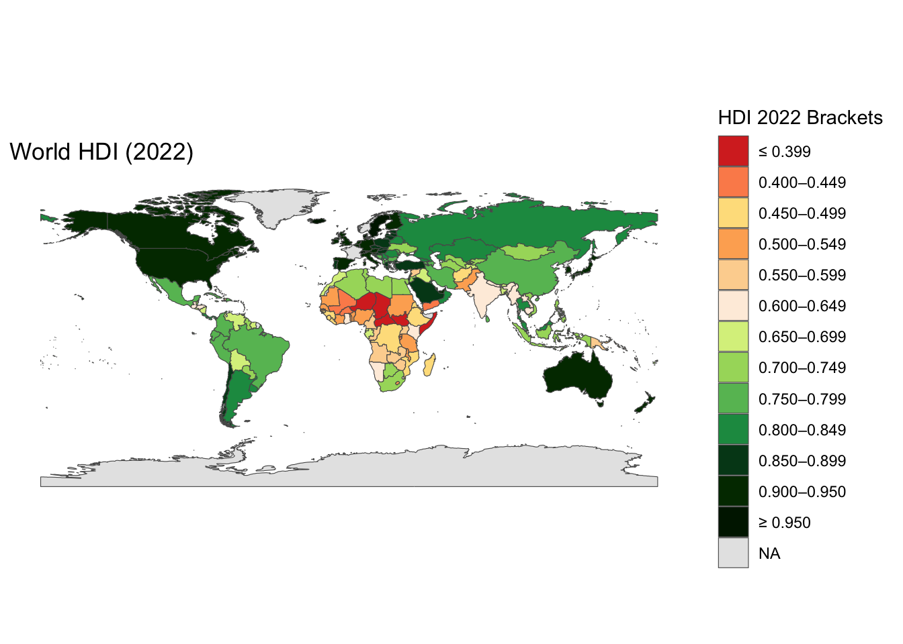
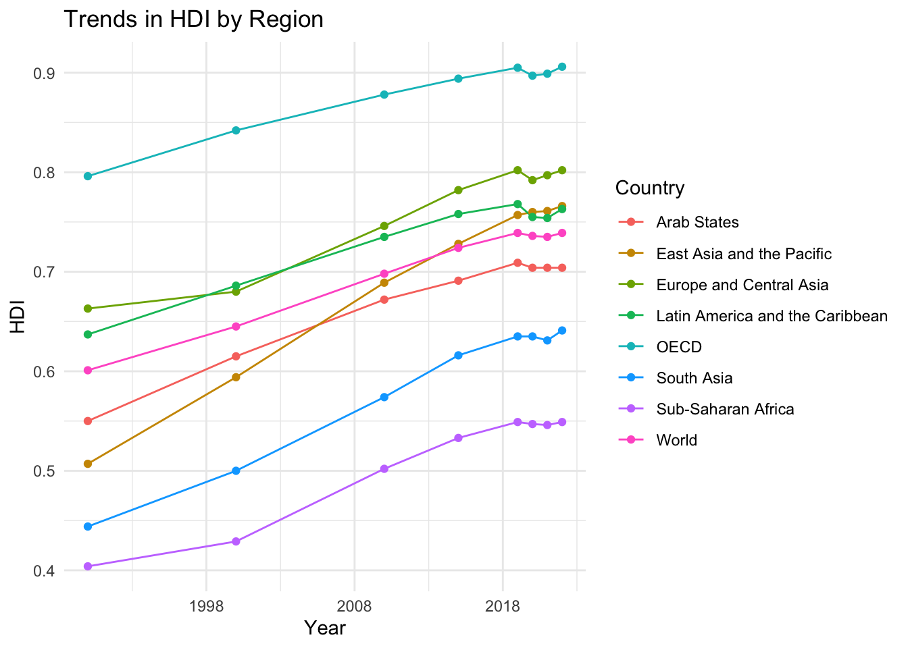

# worldhdi

[](https://zenodo.org/doi/10.5281/zenodo.14006109)
[](https://github.com/openwashdata/worldhdi/actions/workflows/R-CMD-check.yaml)

The goal of worldhdi is to present Human Development Index (HDI) data
from 1990 to 2022 in a tidy format. The data are sourced from the United
Nations Development Programme (UNDP) Human Development Report 2023/2024
Statistical Annex.

## Installation

You can install the development version of worldhdi from
[GitHub](https://github.com/) with:

``` r

# install.packages("devtools")
devtools::install_github("openwashdata/worldhdi")
```

``` r

## Run the following code in console if you don't have the packages
## install.packages(c("dplyr", "knitr", "readr", "stringr", "gt", "kableExtra"))
library(dplyr)
library(knitr)
library(readr)
library(stringr)
library(gt)
library(kableExtra)
library(tidyverse)
library(lubridate)
```

Alternatively, you can download the individual datasets as a CSV or XLSX
file from the table below.

| dataset | CSV | XLSX |
|:---|:---|:---|
| worldhdi | [Download CSV](https://github.com/openwashdata/worldhdi/raw/main/inst/extdata/worldhdi.csv) | [Download XLSX](https://github.com/openwashdata/worldhdi/raw/main/inst/extdata/worldhdi.xlsx) |

## Data

The package provides access to tidy Human Development Index (HDI) data
for 195 countries and territories and 15 UNDP aggregates from 1990 to
2022. The data are sourced from the United Nations Development Programme
(UNDP) Human Development Report 2023/2024 Statistical Annex, published
under the Creative Commons Attribution 3.0 IGO licence.

``` r

library(worldhdi)
```

### worldhdi

The dataset `worldhdi` contains Human Development Index (HDI) data for
195 countries and territories (193 of them ranked) and 15 UNDP
aggregates from 1990 to 2022. It has 210 observations and 17 variables.

``` r

worldhdi |> 
  head(3) |> 
  gt::gt() |>
  gt::as_raw_html()
```

| hdi_rank | country | hdi_1990 | hdi_2000 | hdi_2010 | hdi_2015 | hdi_2019 | hdi_2020 | hdi_2021 | hdi_2022 | rank_change_2015_2022 | avg_growth_1990_2000 | avg_growth_2000_2010 | avg_growth_2010_2022 | avg_growth_1990_2022 | tier_hdi | iso3c |
|---:|:---|---:|---:|---:|---:|---:|---:|---:|---:|---:|---:|---:|---:|---:|:---|:---|
| 1 | Switzerland | 0.850 | 0.885 | 0.940 | 0.952 | 0.960 | 0.957 | 0.965 | 0.967 | 0 | 0.4043282 | 0.6047435 | 0.2362672 | 0.4038199 | Very High | CHE |
| 2 | Norway | 0.845 | 0.914 | 0.938 | 0.952 | 0.961 | 0.963 | 0.964 | 0.966 | -1 | 0.7880282 | 0.2595300 | 0.2454164 | 0.4190857 | Very High | NOR |
| 3 | Iceland | 0.834 | 0.895 | 0.927 | 0.948 | 0.958 | 0.955 | 0.957 | 0.959 | 0 | 0.7084005 | 0.3519162 | 0.2832129 | 0.4373840 | Very High | ISL |

For an overview of the variable names, see the following table.

| variable_name | variable_type | description |
|:---|:---|:---|
| hdi_rank | double | World rank in the Human Development Index as of 2022 |
| country | character | Name of the country, territory or UNDP aggregate |
| hdi_1990 | double | HDI in 1990 |
| hdi_2000 | double | HDI in 2000 |
| hdi_2010 | double | HDI in 2010 |
| hdi_2015 | double | HDI in 2015 |
| hdi_2019 | double | HDI in 2019 |
| hdi_2020 | double | HDI in 2020 |
| hdi_2021 | double | HDI in 2021 |
| hdi_2022 | double | HDI in 2022 |
| rank_change_2015_2022 | double | Change in HDI rank from 2015 to 2022 |
| avg_growth_1990_2000 | double | Average annual HDI growth between 1990 and 2000, in percent |
| avg_growth_2000_2010 | double | Average annual HDI growth between 2000 and 2010, in percent |
| avg_growth_2010_2022 | double | Average annual HDI growth between 2010 and 2022, in percent |
| avg_growth_1990_2022 | double | Average annual HDI growth between 1990 and 2022, in percent |
| tier_hdi | character | HDI tier in 2022 as defined by UNDP: Very High (0.800 and above), High (0.700 to 0.799), Medium (0.550 to 0.699), Low (below 0.550) |
| iso3c | character | ISO 3166-1 alpha-3 country code; missing for the aggregates |

## Example

``` r

library(worldhdi)
library(ggplot2)
library(rnaturalearthdata)
library(rnaturalearth)

# 2022 HDI worldwide 
world <- ne_countries(scale = "medium", returnclass = "sf")

world_map_data <- world |> left_join(worldhdi, by = c("iso_a3" = "iso3c"))

hdi_colors <- c("#d73027", "#fc8d59", "#fee08b", "#fdae61", "#fdd49e", "#feedde", 
                "#d9ef8b", "#a6d96a", "#66bd63", "#1a9850", "#00441b", "#003300", "#001a00", 
                "#e0e0e0") 

ggplot(data = world_map_data) +
  geom_sf(aes(fill = cut(hdi_2022, 
                         breaks = c(-Inf, 0.399, 0.449, 0.499, 0.549, 0.599, 0.649, 0.699, 
                                    0.749, 0.799, 0.849, 0.899, 0.950, Inf), 
                         labels = c("≤ 0.399", "0.400–0.449", "0.450–0.499", "0.500–0.549", 
                                    "0.550–0.599", "0.600–0.649", "0.650–0.699", 
                                    "0.700–0.749", "0.750–0.799", "0.800–0.849", 
                                    "0.850–0.899", "0.900–0.950", "≥ 0.950")))) +
  scale_fill_manual(values = hdi_colors, na.value = "gray90", name = "HDI 2022 Brackets") +
  theme_minimal() +
  labs(title = "World HDI (2022)") +
  theme(axis.text = element_blank(),
        axis.ticks = element_blank(),
        panel.grid = element_blank())
```



### Which countries saw the biggest increases in HDI over this period?

``` r

worldhdi |> 
  filter(!is.na(avg_growth_1990_2022)) |> 
  arrange(desc(avg_growth_1990_2022)) |> 
  select(country, avg_growth_1990_2022) |>
  head(10) |> 
  gt::gt() |>
  gt::as_raw_html()
```

| country    | avg_growth_1990_2022 |
|:-----------|---------------------:|
| Mozambique |             2.074138 |
| Niger      |             1.955641 |
| Myanmar    |             1.899160 |
| Guinea     |             1.754069 |
| Mali       |             1.740998 |
| Rwanda     |             1.695317 |
| Malawi     |             1.670162 |
| Bangladesh |             1.632927 |
| Uganda     |             1.618777 |
| China      |             1.547965 |

### Trends in HDI by region

``` r

# Use the rows where country is Organisation for Economic Co-operation and Development,
# Arab States, East Asia and the Pacific, Europe and Central Asia, Latin America and the Caribbean, World and plot the hdi trends using hdi_1990, hdi_2000, hdi_2010, hdi_2015, hdi_2022

worldhdi |>
  filter(country %in% c("Organisation for Economic Co-operation and Development", 
                        "Arab States", "East Asia and the Pacific", 
                        "Europe and Central Asia", "Latin America and the Caribbean", "World", "Sub-Saharan Africa", "South Asia")) |>
  pivot_longer(cols = starts_with("hdi"), 
               names_to = "year", 
               values_to = "hdi") |>
  mutate(year = gsub("hdi_", "", year),  # Remove "hdi_" prefix
         year = ymd(paste0(year, "-01-01")),  # Convert to date format
         country = ifelse(country == "Organisation for Economic Co-operation and Development", "OECD", country)) |>
  ggplot(aes(x = year, y = hdi, group = country, color = country)) +
  geom_line() +
  geom_point() +
  scale_x_date(date_labels = "%Y", date_breaks = "10 years") +  # Format x-axis as date and show every 10 years
  labs(title = "Trends in HDI by Region", y = "HDI", x = "Year", color = "Country") +  # Set legend title
  theme_minimal()
```



## License

Data are available as
[CC-BY](https://github.com/openwashdata/worldhdi/blob/main/LICENSE.md).

## Citation

Please cite this package using:

``` r

citation("worldhdi")
#> To cite package 'worldhdi' in publications use:
#> 
#>   Dubey Y, Schöbitz L (2024). "worldhdi: Human Development Index
#>   Worldwide 1990-2022 (2024)." doi:10.5281/zenodo.14006109
#>   <https://doi.org/10.5281/zenodo.14006109>.
#>   <https://openwashdata.github.io/worldhdi/>.
#> 
#> A BibTeX entry for LaTeX users is
#> 
#>   @Misc{dubey_etall:2024,
#>     title = {worldhdi: Human Development Index Worldwide 1990-2022 (2024)},
#>     author = {Yash Dubey and Lars Schöbitz},
#>     year = {2024},
#>     doi = {10.5281/zenodo.14006109},
#>     url = {https://openwashdata.github.io/worldhdi/},
#>     abstract = {Provides Human Development Index (HDI) trends from 1990 to 2022 for 195 countries and territories (193 of them ranked) and 15 UNDP aggregates (development groups, regions and the world), from the UNDP Human Development Report 2023/2024 Statistical Annex. It includes HDI ranks, changes in rank and average annual HDI growth.},
#>     keywords = {open data,washdata,human development index,hdi,undp,development indicators,sdgs},
#>     version = {1.0.2},
#>   }
```
